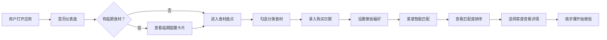

## 1. 产品概述

"料理残局拯救站"是一款面向独居青年和厨房新手的前端灵感工具，帮助用户利用冰箱剩余的零散食材快速拼配出可行菜谱，减少食材浪费，降低做饭门槛。

- 核心价值：解决食材零散不知如何搭配、做饭流程复杂、临期食材易浪费等痛点
- 目标用户：独居青年、厨房新手、注重生活品质的轻食爱好者

## 2. 核心功能

### 2.1 用户角色

| 角色 | 注册方式 | 核心权限 |
|------|----------|----------|
| 普通用户 | 无需注册，本地存储 | 食材盘点、菜谱生成、临期提醒、偏好筛选 |

### 2.2 功能模块

1. **首页仪表盘**：欢迎语、食材数量统计、临期提醒卡片、快捷入口
2. **食材盘点页**：分类勾选（蔬菜/蛋白质/主食/调味料）、添加自定义食材、录入购买日期
3. **菜谱拼配页**：基于现有食材匹配菜谱、显示步骤和所需时间、食材匹配度展示
4. **临期提醒页**：按剩余天数排序、预警色标、建议先吃列表
5. **偏好筛选面板**：一锅优先、十分钟内、少洗碗、素食等做饭偏好筛选

### 2.3 页面详情

| 页面名称 | 模块名称 | 功能描述 |
|----------|----------|----------|
| 首页仪表盘 | 数据概览区 | 显示在库食材总数、临期食材数、今日推荐菜谱 |
| 首页仪表盘 | 临期预警卡 | 红色高亮显示3天内即将过期的食材Top3 |
| 首页仪表盘 | 快捷操作区 | 一键进入食材盘点、随机菜谱灵感、临期清单 |
| 食材盘点页 | 分类选择器 | Tab切换四大分类：蔬菜🥬、蛋白质🍳、主食🍚、调味料🧂 |
| 食材盘点页 | 食材网格 | 可勾选食材卡片，带emoji图标，hover动效 |
| 食材盘点页 | 日期录入 | 选择购买日期，自动计算临期状态 |
| 食材盘点页 | 自定义添加 | 弹窗输入食材名称、选择分类、选择emoji |
| 菜谱拼配页 | 筛选标签栏 | 全部/一锅优先/十分钟/少洗碗/素食 多条件筛选 |
| 菜谱拼配页 | 菜谱卡片列表 | 封面图、菜名、匹配度百分比、耗时、厨具数量 |
| 菜谱拼配页 | 菜谱详情抽屉 | 展开显示完整步骤、所需食材清单、缺失食材提醒 |
| 临期提醒页 | 时间轴列表 | 按剩余天数从少到多排列，红色/黄色/绿色状态条 |
| 临期提醒页 | 建议先吃 | 智能推荐优先使用临期食材的菜谱组合 |
| 偏好筛选面板 | 浮动筛选器 | 多选条件：少洗碗✅、十分钟内⏱️、一锅出🍲、低卡🥗 |

## 3. 核心流程

用户打开应用 → 查看首页临期提醒（如果有）→ 勾选/录入冰箱食材 → 设置做饭偏好（可选）→ 系统基于食材+偏好匹配菜谱 → 用户选择菜谱查看步骤 → 开始做饭

## 4. 用户界面设计

### 4.1 设计风格

- **主色调**：暖橙渐变 (#FF8A3D → #FFB563) — 传递温暖、食欲感
- **辅助色**：
  - 新鲜绿 (#52C41A) — 食材正常状态
  - 提醒黄 (#FAAD14) — 即将临期（3-7天）
  - 警示红 (#F5222D) — 紧急临期（0-3天）
  - 奶油米 (#FFF8F0) — 背景底色，温暖舒适
- **按钮风格**：圆角胶囊按钮，轻微3D阴影，hover时上浮+加深阴影
- **字体**：
  - 标题：ZCOOL KuaiLe / 站酷快乐体 — 活泼有亲和力
  - 正文：Noto Sans SC — 清晰易读
- **布局风格**：卡片式网格布局，圆角柔和，大量留白，底部Tab导航
- **图标风格**：全部使用大尺寸emoji + 彩色SVG混合，增强食欲感和趣味性

### 4.2 页面设计概述

| 页面名称 | 模块名称 | UI元素 |
|----------|----------|--------|
| 首页仪表盘 | 数据概览区 | 大数字统计卡、暖橙渐变背景、微动效数字 |
| 首页仪表盘 | 临期预警卡 | 红色渐变边框、抖动动画警示、倒计时数字 |
| 食材盘点页 | 分类Tab | 图标+文字胶囊Tab，选中态填充主色 |
| 食材盘点页 | 食材卡片 | 圆角卡片、emoji大图、勾选态缩放+绿勾动画 |
| 菜谱拼配页 | 匹配度环 | 环形进度条显示匹配百分比，颜色随匹配度渐变 |
| 菜谱拼配页 | 菜谱卡片 | 左图右文布局、标签胶囊、点击展开抽屉动画 |
| 临期提醒页 | 状态进度条 | 每条食材左侧彩色条，时间轴式排列 |
| 偏好筛选面板 | 浮动筛选 | 底部悬浮胶囊，点击展开多选面板，滑入动画 |

### 4.3 响应式

- 设计方式：桌面优先，移动端自适应
- 断点：768px（平板）、480px（手机）
- 移动端优化：底部Tab导航固定、卡片单列排列、触摸目标≥44px、下拉抽屉全屏化

### 4.4 视觉特效规划

- **页面加载**：各卡片从下往上错峰淡入（staggered reveal）
- **勾选食材**：缩放弹跳动画 + 绿色对勾浮现
- **匹配菜谱**：环形进度条数字滚动动画
- **临期警告**：轻微呼吸闪烁效果（紧急状态）
- **切换分类**：Tab内容区左右滑动过渡
- **卡片hover**：轻微上浮 + 阴影加深 + 边框高光
