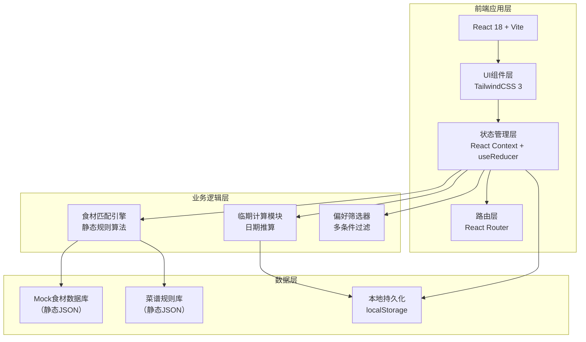

## 1. 架构设计



## 2. 技术描述

- **前端框架**：React@18 + TypeScript + Vite@5
- **样式方案**：TailwindCSS@3 + CSS Variables 主题系统
- **路由管理**：React Router DOM@6（Hash模式，纯前端部署友好）
- **状态管理**：React Context + useReducer（轻量级，无Redux依赖）
- **图标方案**：emoji + 手工SVG（无外部图标库，保持轻量化）
- **数据持久化**：localStorage 封装工具类（食材清单、用户偏好）
- **动画方案**：CSS Transitions/Keyframes + Framer Motion（交互动效）
- **构建工具**：Vite@5（极速HMR）
- **代码规范**：ESLint + Prettier

## 3. 路由定义

| 路由 | 页面组件 | 用途 |
|------|----------|------|
| `/` | DashboardPage | 首页仪表盘，数据概览+临期提醒+快捷入口 |
| `/ingredients` | IngredientsPage | 食材盘点页，分类勾选+日期录入 |
| `/recipes` | RecipesPage | 菜谱拼配页，智能匹配+偏好筛选 |
| `/expiring` | ExpiringPage | 临期提醒页，时间轴+优先建议 |

## 4. 数据模型

### 4.1 数据模型定义

```mermaid
erDiagram
    INGREDIENT {
        string id PK
        string name
        string category
        string emoji
        date purchaseDate
        int shelfLifeDays
    }
    
    RECIPE {
        string id PK
        string name
        string coverEmoji
        string[] ingredientIds
        string[] steps
        int cookTimeMinutes
        int potCount
        boolean onePot
        boolean quickMeal
        boolean lowDishwashing
        boolean vegetarian
    }
    
    USER_PREFERENCE {
        boolean onePot优先
        boolean十分钟内
        boolean少洗碗
        boolean素食
    }
```

### 4.2 核心数据结构

```typescript
// 食材分类
type IngredientCategory = 'vegetable' | 'protein' | 'staple' | 'seasoning';

// 食材项
interface Ingredient {
  id: string;
  name: string;
  category: IngredientCategory;
  emoji: string;
  shelfLifeDays: number; // 默认保质期（天）
}

// 用户录入的在库食材
interface StockIngredient extends Ingredient {
  purchaseDate: string; // ISO日期
  isSelected: boolean;
}

// 临期状态
type ExpiryStatus = 'fresh' | 'warning' | 'urgent';

// 菜谱
interface Recipe {
  id: string;
  name: string;
  coverEmoji: string;
  requiredIngredients: string[]; // ingredient id 列表
  steps: string[];
  cookTimeMinutes: number;
  potCount: number; // 需要的锅具数量
  tags: {
    onePot: boolean;      // 一锅出
    quickMeal: boolean;   // 10分钟内
    lessDishes: boolean;  // 少洗碗
    vegetarian: boolean;  // 素食
  };
}

// 匹配结果
interface MatchedRecipe extends Recipe {
  matchPercentage: number;        // 匹配度 0-100
  matchedIngredients: string[];   // 用户已有的食材id
  missingIngredients: string[];   // 缺少的食材id
}

// 用户偏好
interface UserPreferences {
  onePot: boolean;
  quickMeal: boolean;
  lessDishes: boolean;
  vegetarian: boolean;
}
```

## 5. 核心算法规则

### 5.1 食材匹配算法

```
1. 遍历所有菜谱
2. 对每个菜谱，计算：
   - 用户已选食材 ∩ 菜谱所需食材 = 匹配食材数
   - 匹配度 = (匹配食材数 / 菜谱所需食材数) × 100%
3. 过滤匹配度 > 0% 的菜谱
4. 应用偏好筛选（一锅/十分钟/少洗碗/素食）
5. 按匹配度降序排列，相同匹配度按耗时升序
```

### 5.2 临期计算规则

```
剩余天数 = (购买日期 + 保质期天数) - 当前日期

剩余天数 <= 3  →  urgent（红色警示）
剩余天数 4-7   →  warning（黄色提醒）
剩余天数 > 7   →  fresh（绿色正常）
```

### 5.3 静态菜谱规则库（示例）

- **番茄炒蛋**：番茄+鸡蛋+盐+油 → 10分钟，一锅出，少洗碗
- **青椒土豆丝**：青椒+土豆+盐+醋 → 15分钟，一锅出
- **蒜蓉西兰花**：西兰花+大蒜+盐 → 10分钟，一锅出，素食
- **蛋炒饭**：米饭+鸡蛋+葱+盐+油 → 10分钟，一锅出，少洗碗
- **黄瓜拌木耳**：黄瓜+木耳+蒜+醋+生抽 → 5分钟，无锅，素食
- ...（共30+条静态规则）
